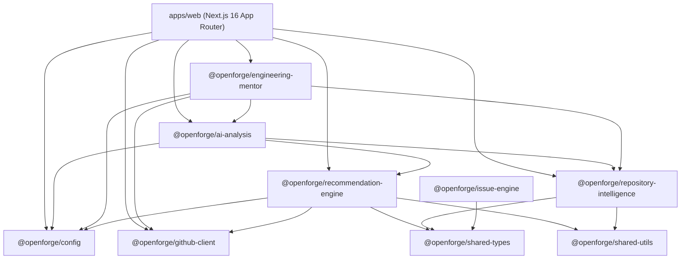

# OpenForge Architecture Guide

OpenForge is a production-ready, AI-powered developer platform built as a high-performance monorepo using **Turborepo** and **npm workspaces**.

---

## Workspace Map

---

## Package Responsibilities

| Package | Purpose | Primary Exports |
|---|---|---|
| `apps/web` | Next.js 16 App Router UI & REST API Endpoints | Interactive dashboard, issue viewer, repository explorer, live search |
| `@openforge/config` | Centralized Zod env validation & app configuration | `env`, `AI_CONFIG`, `CURATED_REPOSITORIES` |
| `@openforge/github-client` | Typed GitHub GraphQL & REST API client | `getIssue`, `getRepository`, `searchRepositories` |
| `@openforge/recommendation-engine` | 5-Factor deterministic issue scoring engine | `scoreIssue`, `generateRecommendations` |
| `@openforge/repository-intelligence` | Dependency detection, architecture parsing, knowledge graph | `SnapshotService`, `KnowledgeGraphBuilder`, `HealthAnalysisService` |
| `@openforge/ai-analysis` | Pluggable LLM provider integration (Ollama & OpenRouter) | `generateIssueSummary`, `generateContributionPlan`, `analyzeIssue` |
| `@openforge/engineering-mentor` | Interactive AI mentor for open-source onboarding | `MentorService`, `generateMentorSession` |
| `@openforge/issue-engine` | Contribution effort estimation engine | `ContributionEstimator` |
| `@openforge/shared-types` | Shared TypeScript interfaces & types | `Issue`, `Repository`, `RecommendationScore` |
| `@openforge/shared-utils` | Pure utility functions (formatting, date math) | `clamp`, `slugify` |

---

## Key Data Flows

### 1. Recommendation Scoring Pipeline
1. Curated repositories are retrieved via `@openforge/github-client` GraphQL queries.
2. Open issues are parsed and categorized.
3. `@openforge/recommendation-engine` evaluates 5 deterministic signals:
   - **Learning Score** (Language, difficulty, topic relevance)
   - **AI Relevance** (Description clarity, LLM task suitability)
   - **Maintainer Friendliness** (Response speed, good first issue labels)
   - **Impact Score** (Stars, forks, milestone priority)
   - **Merge Probability** (Assignee count, open PRs, issue age)
4. Overall score is normalized (0–100) and presented with factor breakdowns.

### 2. Intelligent Issue Analysis Pipeline
1. Client requests `/api/issues/[owner]/[repo]/[number]/analysis`.
2. `buildIssueAnalysisContext` retrieves repository tree snapshot and constructs a knowledge graph.
3. Architecture detector identifies project structure (Monorepo, Clean Architecture, MVC).
4. Recommendation engine scores the issue in read-only mode.
5. Structured prompt is dispatched to the active AI provider (Ollama or OpenRouter).
6. Response is validated against Zod schema and cached in memory.

---

## Security & Caching Architecture

- **Environment Isolation:** Zero runtime API keys or secret tokens are returned in REST envelopes.
- **Debug Route Protection:** Debug endpoints (`/api/debug/*`) return `403 Forbidden` in production mode and enforce `x-debug-secret` authentication in non-production environments.
- **Cache Invalidation:** In-memory snapshot cache (`AnalysisCache`) TTL is managed via `CACHE_TTL` environment settings, and Turborepo `globalEnv` invalidates build outputs when env flags change.